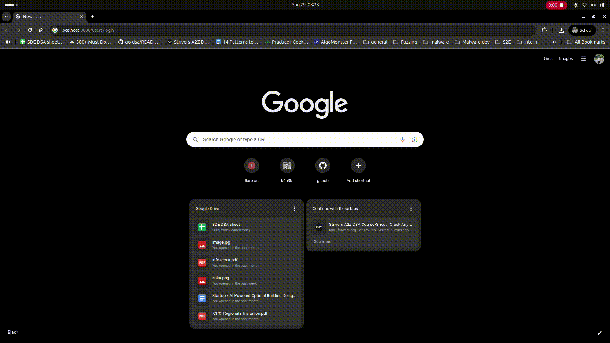

## Secure File Sharing Platform

A lightweight and secure backend service for file storage and collaboration, built with **Golang**, **Gin**, **PostgreSQL**, and **AWS S3**. Users can upload files, share them with collaborators, manage access, and download files securely. Authentication is handled via Google OAuth and JWT.

---

## Features

- **User Authentication**
  - Google OAuth login/signup
  - JWT-based session management
  - Token refresh endpoint

- **File Management**
  - Upload files to AWS S3 with **Server-Side Encryption (KMS)** enabled
  - Download files securely
  - List all files accessible to the user
  - Delete files (only by owner)

- **Collaboration**
  - Share files with other users
  - Remove a collaborator’s access
  - Role-based access (`owner` or `viewer`)

---

## Endpoints

### Auth
| Method | Endpoint | Description |
|--------|----------|-------------|
| GET    | /users/signup | Sign up via Google OAuth |
| GET    | /users/login  | Login via Google OAuth |
| GET    | /google_callback | OAuth callback |
| POST   | /users/refresh | Refresh JWT token |

### Users
| Method | Endpoint | Description |
|--------|----------|-------------|
| GET    | /users | List all users |
| GET    | /users/:user_id | Get a single user’s info |

### Files
| Method | Endpoint | Description |
|--------|----------|-------------|
| POST   | /files/upload | Upload a new file |
| POST   | /files/:file_id/share | Share a file with a collaborator (email in header) |
| GET    | /files | List all accessible files for the user |
| GET    | /files/:file_id/download | Download a file |
| DELETE | /files/:file_id | Delete a file (owner only) |
| DELETE | /files/:file_id/remove | Remove a collaborator from a file (email in header) |

---

## Tech Stack

- **Backend:** Golang, Gin framework  
- **Database:** PostgreSQL  
- **Storage:** AWS S3  
- **Authentication:** Google OAuth, JWT  

---

## Usage

1. Clone the repository.
2. Set environment variables for PostgreSQL and AWS credentials.
3. Run `go run main.go` to start the server.
4. Use a tool like Postman to interact with the API endpoints.

## Screenshots

Login

Upload

Share access

List Files

Download file

Delete File

